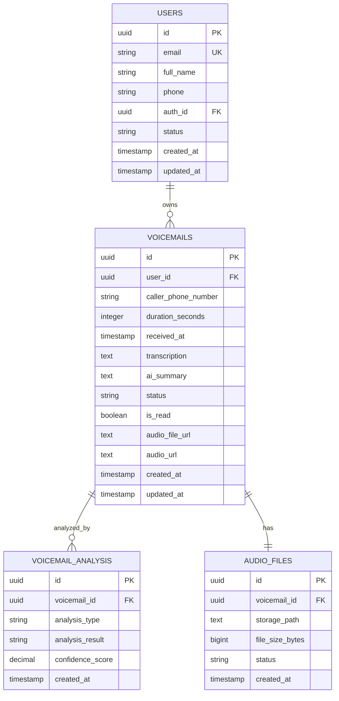

# VoxNow Database Schema - Supabase

## Overview

Simplified database schema for VoxNow platform using Supabase as the backend. This schema focuses on core voicemail management functionality for lawyers.

## Database Configuration

### Supabase Setup
- PostgreSQL 15+ (Supabase managed)
- Row Level Security (RLS) enabled
- Real-time subscriptions for live updates
- Built-in authentication and storage

### Required Extensions
```sql
-- Supabase includes these by default
CREATE EXTENSION IF NOT EXISTS "uuid-ossp";
CREATE EXTENSION IF NOT EXISTS "pgcrypto";
```

## Core Tables (Current Implementation)

### 1. USERS Table
**Purpose**: Lawyer authentication and profile management

```sql
CREATE TABLE users (
    id UUID PRIMARY KEY DEFAULT gen_random_uuid(),
    email VARCHAR(255) UNIQUE NOT NULL,
    full_name VARCHAR(255) NOT NULL,
    phone VARCHAR(50),
    avatar_url TEXT,
    
    -- Preferences
    preferences JSONB DEFAULT '{}',
    
    -- Supabase Auth Integration
    auth_id UUID REFERENCES auth.users(id) ON DELETE CASCADE,
    
    -- Status
    status VARCHAR(20) DEFAULT 'active' 
        CHECK (status IN ('active', 'inactive', 'suspended')),
    
    -- Demo flag for public demo user
    demo_user BOOLEAN DEFAULT FALSE,
    
    -- Timestamps
    last_login TIMESTAMP WITH TIME ZONE,
    created_at TIMESTAMP WITH TIME ZONE DEFAULT NOW(),
    updated_at TIMESTAMP WITH TIME ZONE DEFAULT NOW()
);

-- Indexes
CREATE INDEX idx_users_email ON users(email);
CREATE INDEX idx_users_auth_id ON users(auth_id);
CREATE INDEX idx_users_status ON users(status);

-- Row Level Security
ALTER TABLE users ENABLE ROW LEVEL SECURITY;

-- Policy: Users can only see their own data
CREATE POLICY users_own_data ON users
    FOR ALL TO authenticated
    USING (auth_id = auth.uid());

-- Trigger for updated_at
CREATE TRIGGER update_users_updated_at
    BEFORE UPDATE ON users
    FOR EACH ROW
    EXECUTE FUNCTION update_updated_at_column();
```

### 2. VOICEMAILS Table
**Purpose**: Central voicemail record storage

```sql
CREATE TABLE voicemails (
    id UUID PRIMARY KEY DEFAULT gen_random_uuid(),
    user_id UUID NOT NULL REFERENCES users(id) ON DELETE CASCADE,
    
    -- Call Information
    caller_phone_number VARCHAR(50),
    caller_name VARCHAR(255),
    duration_seconds INTEGER CHECK (duration_seconds >= 0),
    received_at TIMESTAMP WITH TIME ZONE NOT NULL,
    
    -- Content
    audio_file_url TEXT, -- Download URL for audio file
    audio_url TEXT, -- Web player URL for inline audio playback
    transcription TEXT,
    ai_summary TEXT,
    original_language CHAR(2) DEFAULT 'fr',
    
    -- Status Management
    status VARCHAR(20) DEFAULT 'new' 
        CHECK (status IN ('new', 'processing', 'reviewed', 'archived', 'deleted')),
    priority VARCHAR(10) DEFAULT 'normal' 
        CHECK (priority IN ('low', 'normal', 'high', 'urgent')),
    
    -- User Interaction
    is_read BOOLEAN DEFAULT FALSE,
    is_starred BOOLEAN DEFAULT FALSE,
    read_at TIMESTAMP WITH TIME ZONE,
    
    -- Quality Metrics
    transcription_confidence DECIMAL(3,2) CHECK (transcription_confidence BETWEEN 0 AND 1),
    audio_quality_score DECIMAL(3,2) CHECK (audio_quality_score BETWEEN 0 AND 1),
    
    -- Demo flag for public demo data
    demo_data BOOLEAN DEFAULT FALSE,
    
    -- Metadata
    tags TEXT[],
    notes TEXT,
    metadata JSONB DEFAULT '{}',
    
    -- Timestamps
    created_at TIMESTAMP WITH TIME ZONE DEFAULT NOW(),
    updated_at TIMESTAMP WITH TIME ZONE DEFAULT NOW()
);

-- Indexes for Performance
CREATE INDEX idx_voicemails_user_received ON voicemails(user_id, received_at DESC);
CREATE INDEX idx_voicemails_status ON voicemails(status);
CREATE INDEX idx_voicemails_caller_phone ON voicemails(caller_phone_number);
CREATE INDEX idx_voicemails_priority_status ON voicemails(priority, status);
CREATE INDEX idx_voicemails_is_read ON voicemails(is_read, user_id);

-- Full-text Search Indexes
CREATE INDEX idx_voicemails_transcription_fts ON voicemails 
    USING gin(to_tsvector('french', COALESCE(transcription, '')));
CREATE INDEX idx_voicemails_ai_summary_fts ON voicemails 
    USING gin(to_tsvector('french', COALESCE(ai_summary, '')));
CREATE INDEX idx_voicemails_tags_gin ON voicemails USING gin(tags);

-- Row Level Security
ALTER TABLE voicemails ENABLE ROW LEVEL SECURITY;

-- Policy: Users can only see their own voicemails
CREATE POLICY voicemails_own_data ON voicemails
    FOR ALL TO authenticated
    USING (user_id IN (
        SELECT id FROM users WHERE auth_id = auth.uid()
    ));

-- Trigger for updated_at
CREATE TRIGGER update_voicemails_updated_at
    BEFORE UPDATE ON voicemails
    FOR EACH ROW
    EXECUTE FUNCTION update_updated_at_column();
```

### 3. VOICEMAIL_ANALYSIS Table
**Purpose**: AI analysis results with confidence scoring

```sql
CREATE TABLE voicemail_analysis (
    id UUID PRIMARY KEY DEFAULT gen_random_uuid(),
    voicemail_id UUID NOT NULL REFERENCES voicemails(id) ON DELETE CASCADE,
    
    -- Analysis Configuration
    analysis_type VARCHAR(50) NOT NULL 
        CHECK (analysis_type IN ('sentiment', 'urgency', 'category', 'legal_domain', 'case_stage', 'intent')),
    
    -- Results
    analysis_result VARCHAR(500) NOT NULL,
    confidence_score DECIMAL(4,3) CHECK (confidence_score BETWEEN 0 AND 1),
    
    -- AI Model Information
    ai_model_name VARCHAR(100),
    ai_model_version VARCHAR(50),
    processing_time_ms INTEGER,
    
    -- Raw Data (for debugging/improvement)
    raw_response JSONB,
    
    created_at TIMESTAMP WITH TIME ZONE DEFAULT NOW()
);

-- Indexes
CREATE INDEX idx_voicemail_analysis_voicemail ON voicemail_analysis(voicemail_id);
CREATE INDEX idx_voicemail_analysis_type_result ON voicemail_analysis(analysis_type, analysis_result);
CREATE INDEX idx_voicemail_analysis_confidence ON voicemail_analysis(confidence_score DESC);

-- Unique constraint for analysis type per voicemail
CREATE UNIQUE INDEX idx_voicemail_analysis_unique_type 
    ON voicemail_analysis(voicemail_id, analysis_type);

-- Row Level Security
ALTER TABLE voicemail_analysis ENABLE ROW LEVEL SECURITY;

-- Policy: Users can only see analysis for their own voicemails
CREATE POLICY voicemail_analysis_own_data ON voicemail_analysis
    FOR ALL TO authenticated
    USING (voicemail_id IN (
        SELECT v.id FROM voicemails v
        JOIN users u ON v.user_id = u.id
        WHERE u.auth_id = auth.uid()
    ));
```

### 4. AUDIO_FILES Table
**Purpose**: Audio file storage management (Supabase Storage)

```sql
CREATE TABLE audio_files (
    id UUID PRIMARY KEY DEFAULT gen_random_uuid(),
    voicemail_id UUID NOT NULL REFERENCES voicemails(id) ON DELETE CASCADE,
    
    -- Supabase Storage Information
    storage_path TEXT NOT NULL, -- Path in Supabase Storage bucket
    original_filename VARCHAR(255),
    
    -- File Properties
    file_size_bytes BIGINT CHECK (file_size_bytes > 0),
    mime_type VARCHAR(100) DEFAULT 'audio/mpeg',
    duration_seconds INTEGER CHECK (duration_seconds > 0),
    
    -- Audio Properties
    format VARCHAR(20), -- 'mp3', 'wav', 'ogg', etc.
    sample_rate INTEGER,
    bit_rate INTEGER,
    
    -- Processing Status
    status VARCHAR(20) DEFAULT 'uploading' 
        CHECK (status IN ('uploading', 'available', 'processing', 'archived', 'error')),
    
    -- Quality Metrics
    audio_quality_score DECIMAL(3,2) CHECK (audio_quality_score BETWEEN 0 AND 1),
    
    -- Lifecycle Management
    uploaded_at TIMESTAMP WITH TIME ZONE DEFAULT NOW(),
    processed_at TIMESTAMP WITH TIME ZONE,
    
    -- Error Information
    error_message TEXT,
    
    created_at TIMESTAMP WITH TIME ZONE DEFAULT NOW(),
    updated_at TIMESTAMP WITH TIME ZONE DEFAULT NOW()
);

-- Indexes
CREATE INDEX idx_audio_files_voicemail ON audio_files(voicemail_id);
CREATE INDEX idx_audio_files_status ON audio_files(status);
CREATE INDEX idx_audio_files_storage_path ON audio_files(storage_path);

-- Row Level Security
ALTER TABLE audio_files ENABLE ROW LEVEL SECURITY;

-- Policy: Users can only see audio files for their own voicemails
CREATE POLICY audio_files_own_data ON audio_files
    FOR ALL TO authenticated
    USING (voicemail_id IN (
        SELECT v.id FROM voicemails v
        JOIN users u ON v.user_id = u.id
        WHERE u.auth_id = auth.uid()
    ));

-- Trigger for updated_at
CREATE TRIGGER update_audio_files_updated_at
    BEFORE UPDATE ON audio_files
    FOR EACH ROW
    EXECUTE FUNCTION update_updated_at_column();
```

## Future Implementation Tables

### 5. FORM_SUBMISSIONS Table (Future)
**Purpose**: Lead generation and contact forms

```sql
-- TODO: Implement when needed for lead generation
CREATE TABLE form_submissions (
    id UUID PRIMARY KEY DEFAULT gen_random_uuid(),
    
    -- Form Information
    form_type VARCHAR(50) NOT NULL 
        CHECK (form_type IN ('contact', 'demo_request', 'trial_signup')),
    
    -- Contact Information
    email VARCHAR(255) NOT NULL,
    phone VARCHAR(50),
    full_name VARCHAR(255),
    company VARCHAR(255),
    
    -- Submission Data
    form_data JSONB NOT NULL DEFAULT '{}',
    
    -- Processing Status
    status VARCHAR(20) DEFAULT 'new' 
        CHECK (status IN ('new', 'contacted', 'converted', 'rejected')),
    
    -- Source Tracking
    referral_source VARCHAR(100),
    
    submitted_at TIMESTAMP WITH TIME ZONE DEFAULT NOW(),
    processed_at TIMESTAMP WITH TIME ZONE
);
```

### 6. SUBSCRIPTIONS Table (Future)
**Purpose**: Billing and subscription management

```sql
-- TODO: Implement when billing is needed
CREATE TABLE subscriptions (
    id UUID PRIMARY KEY DEFAULT gen_random_uuid(),
    user_id UUID NOT NULL REFERENCES users(id) ON DELETE CASCADE,
    
    -- Plan Information
    plan_name VARCHAR(100) NOT NULL,
    plan_type VARCHAR(20) DEFAULT 'monthly' 
        CHECK (plan_type IN ('trial', 'monthly', 'annual')),
    
    -- Pricing
    price DECIMAL(10,2) NOT NULL CHECK (price >= 0),
    currency CHAR(3) DEFAULT 'EUR',
    
    -- Usage Limits
    included_minutes INTEGER DEFAULT 0,
    included_storage_gb INTEGER DEFAULT 1,
    
    -- Status
    status VARCHAR(20) DEFAULT 'trial' 
        CHECK (status IN ('trial', 'active', 'cancelled', 'expired')),
    
    -- Billing Dates
    current_period_start DATE NOT NULL,
    current_period_end DATE NOT NULL,
    trial_end_date DATE,
    
    created_at TIMESTAMP WITH TIME ZONE DEFAULT NOW(),
    updated_at TIMESTAMP WITH TIME ZONE DEFAULT NOW()
);
```

### 7. BILLING_TRANSACTIONS Table (Future)
**Purpose**: Payment transaction tracking

```sql
-- TODO: Implement when payment processing is needed
CREATE TABLE billing_transactions (
    id UUID PRIMARY KEY DEFAULT gen_random_uuid(),
    subscription_id UUID NOT NULL REFERENCES subscriptions(id) ON DELETE CASCADE,
    
    -- Transaction Details
    amount DECIMAL(10,2) NOT NULL,
    currency CHAR(3) DEFAULT 'EUR',
    description TEXT NOT NULL,
    
    -- Payment Status
    status VARCHAR(20) DEFAULT 'pending' 
        CHECK (status IN ('pending', 'completed', 'failed', 'refunded')),
    
    -- External Payment Information
    payment_method VARCHAR(50),
    external_transaction_id VARCHAR(255),
    
    processed_at TIMESTAMP WITH TIME ZONE,
    created_at TIMESTAMP WITH TIME ZONE DEFAULT NOW()
);
```

## Utility Functions

### Updated Timestamp Function
```sql
CREATE OR REPLACE FUNCTION update_updated_at_column()
RETURNS TRIGGER AS $$
BEGIN
    NEW.updated_at = NOW();
    RETURN NEW;
END;
$$ language 'plpgsql';
```

## Entity Relationship Diagram



## Common Queries

### Dashboard Voicemail Listing
```sql
SELECT 
    v.*,
    af.storage_path,
    array_agg(
        CASE 
            WHEN va.analysis_type IS NOT NULL 
            THEN json_build_object(va.analysis_type, va.analysis_result)
        END
    ) FILTER (WHERE va.analysis_type IS NOT NULL) as analysis_results
FROM voicemails v
LEFT JOIN audio_files af ON v.id = af.voicemail_id
LEFT JOIN voicemail_analysis va ON v.id = va.voicemail_id
WHERE v.user_id = $1
GROUP BY v.id, af.storage_path
ORDER BY v.received_at DESC
LIMIT 50;
```

### Search Voicemails by Content
```sql
SELECT v.*, ts_rank(to_tsvector('french', v.transcription), plainto_tsquery('french', $2)) as rank
FROM voicemails v
WHERE v.user_id = $1 
  AND to_tsvector('french', v.transcription) @@ plainto_tsquery('french', $2)
ORDER BY rank DESC, v.received_at DESC;
```

## Supabase-Specific Features

### Real-time Subscriptions
```javascript
// Listen for new voicemails
const subscription = supabase
  .channel('voicemails')
  .on('postgres_changes', 
    { event: 'INSERT', schema: 'public', table: 'voicemails' },
    (payload) => {
      console.log('New voicemail:', payload.new);
    }
  )
  .subscribe();
```

### Storage Integration
```javascript
// Upload audio file to Supabase Storage
const { data, error } = await supabase.storage
  .from('audio-files')
  .upload(`voicemails/${voicemailId}.mp3`, audioFile);

// Get public URL
const { data: { publicUrl } } = supabase.storage
  .from('audio-files')
  .getPublicUrl(`voicemails/${voicemailId}.mp3`);
```

## Audio URL Fields Explanation

### audio_file_url vs audio_url

The voicemails table contains two different URL fields for audio files:

- **`audio_file_url`**: Direct download URL for the audio file
  - Used for downloading the file to the user's device
  - Typically points to a storage service (S3, Firebase Storage, etc.)
  - File format is usually MP3 or WAV
  - May have CORS restrictions that prevent direct browser playback

- **`audio_url`**: Web player URL for inline audio playback
  - Used for playing audio directly in the browser
  - Designed to work with HTML5 audio elements
  - Optimized for streaming and web playback
  - Should not have CORS restrictions

**Implementation Note**: The frontend uses `audio_url` for the play button (inline playback) and `audio_file_url` for the download button. This separation allows for better user experience and resolves CORS issues that can occur when trying to play download URLs directly in the browser.

This simplified schema focuses on your core needs while providing a clear path for future enhancements when you're ready to implement billing and other features.